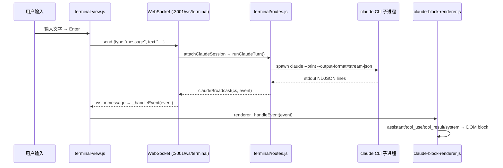

# nanocode 开发者上手指南

> 适用对象：团队新成员（人或 agent）  
> 更新日期：2026-06-06  
> 用户文档见 [README.md](./README.md)（本文不重复 README 内容）

---

## 1. 仓库定位

nanocode 是主人（zhiningjiao）自研的 **Web 终端工作区**，基于 Node.js + Express + xterm.js + WebSocket + node-pty，把 Claude Code CLI（`claude --print --output-format=stream-json`）包装成浏览器可用的多标签 UI，支持同时管理多个 project / agent（Claude / Codex / OpenCode / Cursor）。  
它与 claude CLI 的关系：**宿主 shell，不是 SDK 调用**——nanocode spawn claude 子进程，解析其 stream-json 输出，渲染到自定义 block UI。

---

## 2. 冷启动 5 分钟

```bash
cd /storage/home/zhiningjiao/code/nanocode
npm install                     # 装依赖（node-pty 需要原生编译）
PORT=3001 node server/index.js  # 启开发实例（3001 是主人开发实例）
curl http://10.18.8.55:3001/api/health   # 预期返回 {"status":"ok"}
```

> **系统服务** 跑在 2333（`NANOCODE_SYSTEM=1`），3001 是主人开发实例，平时改代码只动 3001。

打开浏览器 → `http://10.18.8.55:3001` → 左侧选择一个 project → 点 `+` 新建 claude tab → 开始对话。

---

## 3. 架构速览

```
nanocode/
├── server/
│   ├── index.js          # Express app 启动 + /api/health + /api/settings + TTS 代理
│   ├── store.js          # JSON 持久化（projects / tabs / settings），原子写入
│   ├── router-mode.js    # NANOCODE_SYSTEM=1 时启动多用户路由模式（2333 端口）
│   └── qa-watcher.js     # QA 信号文件监视，推 ntfy 通知
├── terminal/
│   ├── routes.js         # 所有 /api/* 路由 + WebSocket handler（最核心文件，~1600 行）
│   ├── sessions.js       # node-pty 终端 session 生命周期
│   ├── files.js          # 文件浏览 /api/files 路由
│   └── agents.js         # Recent-agents 扫描逻辑
└── public/js/
    ├── app.js            # 顶层组装：init sidebar + landing + tab + settings 面板
    ├── terminal-view.js  # Claude/Codex tab UI：输入框 + slash 下拉 + 工具栏 + 渲染器挂载
    ├── claude-block-renderer.js  # stream-json → DOM block 渲染（~1900 行，核心渲染引擎）
    ├── codex-block-renderer.js   # Codex CLI 输出渲染（轻量版）
    ├── tab-manager.js    # 多标签管理（create/close/activate）
    ├── sidebar.js        # 左侧 project 列表
    ├── landing.js        # 欢迎页（host / project 选择表单）
    └── router.js         # 前端 URL slug 路由
```

---

## 4. 核心数据流



关键 event types（来自 claude stream-json）：
- `system/init` — 会话初始化，含 model / tools / slash_commands / plugins
- `assistant/partial_message` — 流式增量文字
- `assistant` — 完整 assistant 消息（含 tool_use content）
- `tool_result` — 工具执行结果
- `result` — 整个 turn 结束信号

---

## 5. 状态机要点（全在 `terminal/routes.js`）

| 机制 | 函数/位置 | 说明 |
|---|---|---|
| **session lock GC（N20）** | `gcClaudeSessions()` L1161 | 扫 `~/.claude/sessions/*.json`，kill -0 判 PID 存活，清理孤立 lock，首 turn 自动触发 |
| **消息队列（N52 dedup）** | `runClaudeTurn()` L1224 + `cs.queue[]` | busy 时入队（FIFO），exit 后 flush；interrupt 时清空队列 |
| **busy retry** | `runClaudeTurn()` 内 `_runWithRetry` | session lock 被占时最多重试 3 次，失败标 `[blocked]` |
| **history fallback / active-guard** | `GET /api/projects/:id/tabs/:tabId/history` L482 | 若 tab 存的 claudeSessionId = 当前主 Claude Code 进程的 session，跳过直连（避免 lock 冲突），fallback 到目录最新 jsonl |
| **/resume 拦截** | L1326 `resume-trigger` 处理 | `--print` 模式下 claude 原生 /resume 不可用；nanocode 拦截字符串，手动路由到最新 session |

---

## 6. 改代码前必看

1. **`research/audit-2026-06-06/README.md`** — 最新审计总览（3 个子文件）：
   - `nanocode_vs_official.md`：21 条自实现 vs claude CLI 官方等价物对照（含 file:line 引用）
   - `feature_gap_priority.md`：18 条 P0/P1/P2/P3 待做清单（总估时 ~39h）
   - `block_rendering_opensource.md`：12 个竞品渲染调研

2. **`proposals.md`** — 历史提案归档（含 TTS 方案设计、已完成项）

3. **当前进行中任务**：见 [TODO.md](./TODO.md)。codex 任务 #66（架构 refactor）正在运行，**改 routes.js / renderer 前先确认它的进度**，避免 merge 冲突。

---

## 7. 热重启 SOP

（来源：[CLAUDE.md](./CLAUDE.md) L13-16，**始终保证至少一个端口可用**）

```bash
# 1. 起备用端口（3002）
PORT=3002 node server/index.js &
curl http://10.18.8.55:3002/api/health   # 确认 200

# 2. 停 3001
kill $(lsof -t -i:3001)

# 3. 起新 3001
PORT=3001 node server/index.js &
curl http://10.18.8.55:3001/api/health   # 确认 200

# 4. 停备用 3002
kill $(lsof -t -i:3002)
```

> 禁止先 kill 3001 再起 3001，中间会有空窗期。

---

## 8. Git 流程

| 操作 | 命令 |
|---|---|
| push 代码 | `git push fork <branch>` （fork = ZhiNningJiao/nanocode） |
| 开 PR | `gh pr create --repo ZhiNningJiao/nanocode` |
| 查 origin | `origin` = victoriacity/nanocode（**只读**，无 push 权限） |

规则（来源：CLAUDE.md + 全局 SOP）：
- **绝不直接提交到 main/master**
- 工作分支命名：`zhining/<目标简述>`
- 里程碑或 3+ 未推 commit → push fork，不开 PR
- 全部任务完成后主人说开 PR 才开
- **禁止 force push，禁止 merge main**

---

## 9. 现役 feature 一览

（已实现并在 3001 上线，来源：work-log.md + audit）

- **active-session-guard** — 防止 tab 续接正在运行的主进程 session（L482）
- **dynamic slash 105+ 条** — 从 claude init 事件动态加载，不再硬编码（`terminal-view.js:329`）
- **model + effort 下拉** — Settings 面板选择 claude model / effort，追加到 launchArgs（`routes.js:1249`）
- **auth status 显示** — Settings 面板显示当前 claude 账号（`/api/auth/status`）
- **permission_mode** — Settings 可切 bypass / accept-edits / auto（`routes.js:1253`）
- **--name flag** — 用 tab.label 作为 claude `--name` 参数（session 在 /resume 里有可读名）
- **Edit/Write diff 渲染** — tool_use 块对 Edit/Write 工具渲染红绿 diff（`claude-block-renderer.js:1417`）
- **init model 显示** — session init block 显示 model 名 + plugin 数（`renderer.js:1307`）
- **thinking 折叠** — `type:'thinking'` content 渲染为可折叠淡色 panel（`renderer.js:1614`）
- **tool 17 图标** — `TOOL_ICONS` map 含 17 种工具 SVG 图标（`renderer.js:157`）
- **image inline** — tool_result 中 base64/URL image 渲染为 ``（`renderer.js:1902`）
- **block freeze** — assistant block 完成后设 `data-frozen=1`，跳过后续 rAF 重渲（`renderer.js:1537`）
- **closing-backtick guard** — 流式渲染中检测未闭合 ``` 并裁剪，防排版崩溃（`renderer.js:309`）
- **/resume 拦截** — `--print` 模式不支持原生 /resume，nanocode 拦截并手动路由（`routes.js:1326`）
- **FIFO 消息队列** — busy 时入队，turn 结束 flush，interrupt 清空（`routes.js:1228`）
- **N20 session GC** — 首 turn 自动清理孤立 claude session lock 文件（`routes.js:1161`）

---

## 10. 常见踩坑

1. **改 renderer 不热重启也不刷新浏览器，以为没生效**  
   server 重启后浏览器缓存可能仍是旧 JS（iOS Safari 尤甚）。重启后加 `?v=xxx` 或强刷（Shift+Reload）。

2. **busy 时发消息被入队，误以为功能坏了**  
   看 session init block 是否显示 `[queued: ...]`，这是正常行为，不是 bug。

3. **subagent prompt 看不见**  
   Settings → Tool blocks fold 如果设为 `header` 或 `line`，body 被 CSS 折叠。subagent-prompt blocks 不受此控制，但需确认 subagent-activity-visible 开关已开。

4. **history fallback 拿到了错误 session**  
   `history:active-guard` 日志会打出被跳过的 sessionId。若仍有问题，检查 `tab.claudeSessionId` 是否正确写入 store（`store.js` 原子写入有 `.tmp` 中间态）。

5. **slash 命令菜单不完整，少了 plugin 命令**  
   `/api/claude/slash-commands` 依赖 spawn 一个 claude 子进程拿 init 事件，首次需 ~15s（有 timeout），失败则 fallback 到 7 条硬编码。检查 `lsof -t -i:3001` 确认 claude 可以 spawn。

---

## 11. 联系人

- 主人：zhiningjiao@meshy.ai
- 验收官（Gemini Flash 3 Cursor Agent）：跑完任务推 qa-signal.json 通知
- 巡检：ralph-loop（`/ralph-loop` 启动，身份标识 `[nanocode]`）
