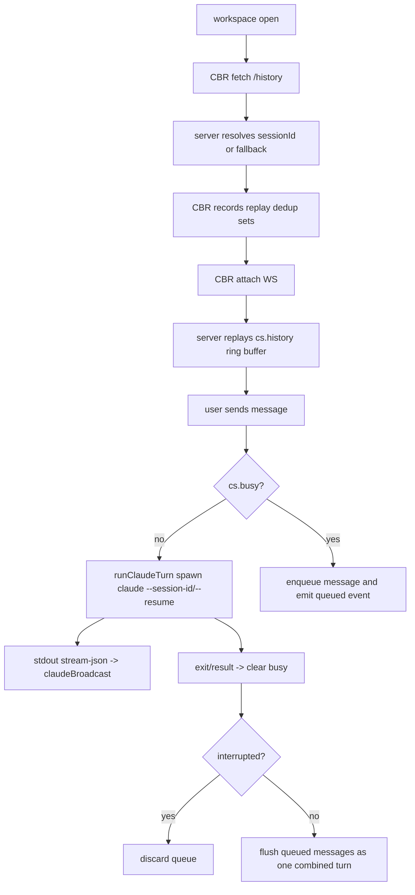

# NANOCODE Architecture Audit

Date: 2026-06-06
Repo: `/storage/home/zhiningjiao/code/nanocode`
Branch: `zhining/nanocode-selfresume-bugs`

## Scope Read

- `terminal/routes.js`
- `public/js/claude-block-renderer.js`
- `public/js/terminal-view.js`
- `public/js/app.js`
- `server/index.js`
- `CLAUDE.md`
- `proposals.md`
- `research/audit-2026-06-06/*`

## Current State Machine

## Architecture Notes

`terminal/routes.js` is the real session controller. It currently owns:

- REST routes
- recent-agent scanning
- history parsing and fallback
- Claude spawn / retry / queue / interrupt
- WebSocket attach and replay

`ClaudeBlockRenderer` is also overloaded. It owns:

- disk-history replay state
- replay dedup
- reconnect orchestration
- live stream rendering
- tool/result pairing
- subagent visibility and fold state

That split works, but both sides now contain state-machine logic, not just transport/rendering logic. The bugs showing up are mostly boundary bugs between these two controllers.

## Defense Matrix

| Logic | Location | What it protects | Overlap | Blind spot |
|---|---|---|---|---|
| `N19` reset clear | `terminal-view.js`, `claude-block-renderer.js` | stale queue + stale DOM after reset | overlaps with server reset route | only runs if UI triggers reset path |
| `N20` lock GC | `terminal/routes.js` | stale `~/.claude/sessions/*.json` lock files | overlaps with session-conflict retry | does not help if current turn is misclassified after user interrupt |
| `N52` replay dedup | `terminal/routes.js`, `claude-block-renderer.js` | duplicate assistant/user replay on reconnect | overlaps with replay UUID/text dedup | still high-complexity; parser and renderer each do dedup |
| active-session guard | `history` route | avoid resuming live main session | overlaps with newest-jsonl fallback guard | does not help `/resume` if recent-agent cache is cold |
| queue drain | `runClaudeTurn` exit path | preserves messages while busy | overlaps with client `_pendingQueue` | interruption classification is the single critical hinge |
| freeze / rAF throttling | `ClaudeBlockRenderer` | avoids expensive live re-render churn | overlaps with final-result cleanup | purely render-side, does not reduce protocol complexity |

## Findings

### P0: interrupt path was trusting OS exit signal instead of user intent

Root cause:

- `runClaudeTurn()` classified interrupt by `signal === 'SIGINT'`.
- Claude can handle SIGINT gracefully and exit `code=0, signal=null`.
- When that happened, nanocode treated the turn as normal completion and flushed the server queue.
- User-visible failure: pressing Stop could still execute queued messages the user was trying to abandon.

Impact:

- violates the queue contract
- creates stop/queue race behaviour
- can look like "Stop ignored" even though the child really was interrupted

Fix landed:

- mark the live subprocess object with `_nanocodeInterrupted = true` in the interrupt route before sending the signal
- classify exit as interrupted if either:
  - `signal === 'SIGINT'`, or
  - the subprocess carried the interrupt marker

Verification:

- `server/tests/claude-interrupt-route.test.js`
- `npm test`

### P1: `/resume` depended on drawer cache warm-up, so first use could fail

Root cause:

- `/resume` interception intentionally uses `_recentAgentsCache`.
- that cache was only populated by `GET /api/recent-agents`
- normal conversation entry path is `history -> attach`, not opening the Recent Agents drawer
- first `/resume` in a fresh page session could therefore say "No previous session found" even when valid session jsonl files existed

Impact:

- `/resume` feature was nondeterministic
- failure depended on whether the drawer had been opened earlier
- red-line feature looked flaky without any backend/session problem

Fix landed:

- extracted recent-agent scan/cache helpers from the route body
- prime the cache during Claude history restore
- kept the existing `/resume` interception block unchanged

Verification:

- `server/tests/claude-resume-cache-route.test.js`
- `npm test`

## Implemented Fixes

1. `arch-refactor: preserve interrupt semantics when claude exits cleanly`
2. `arch-refactor: prime recent-agent cache during history restore`

## Deferred P2/P3

### P2: history replay still has split-brain dedup responsibilities

`routes.js` deduplicates assistant rows, and `ClaudeBlockRenderer` deduplicates replayed events again. That is workable but fragile because ordering assumptions are duplicated across server and client.

Recommended next step:

- extract history parsing into a pure module with fixture-based tests
- make server emit one canonical replay stream
- downgrade renderer dedup to transport-only dedup

### P2: `terminal/routes.js` should be split by ownership, not endpoint type

Recommended extraction order:

1. `claude-history.js`
2. `recent-agents.js`
3. `claude-session-controller.js`

This would make the state machine testable without spinning up the whole router.

### P3: `ClaudeBlockRenderer` still mixes protocol, replay, and render concerns

Recommended extraction order:

1. replay cache / dedup helper
2. tool/result pairing helper
3. pure DOM render helpers

## Verification Run

- Read-path audit completed
- Unit/integration regression:
  - `npm test` -> pass

## Pending Delivery Items

- Playwright screenshot pass
- hot restart `3001`
- write final report to `/storage/home/zhiningjiao/codex_work/NANOCODE_ARCH_REPORT.md`
- write DONE flag to `/storage/home/zhiningjiao/codex_work/nanocode_arch_DONE`
- commit each fix separately
- push to `fork/zhining/nanocode-selfresume-bugs`
